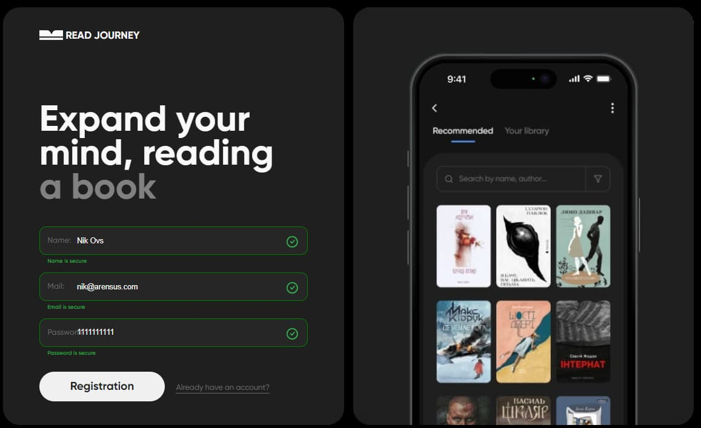
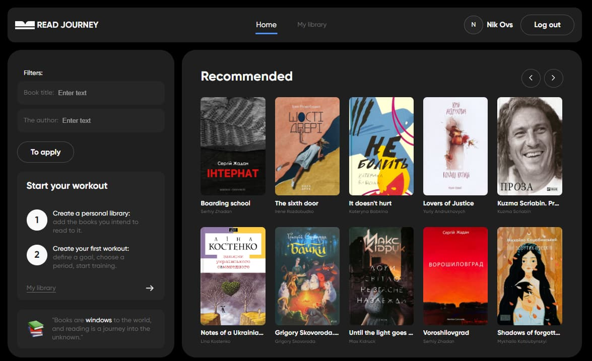
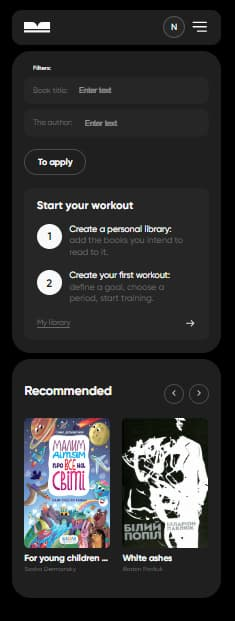
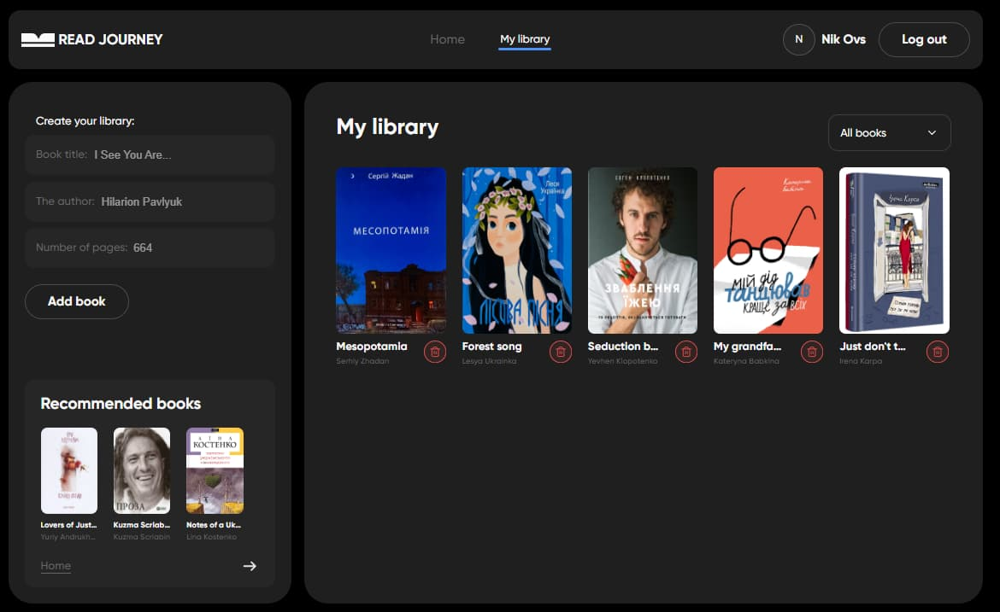
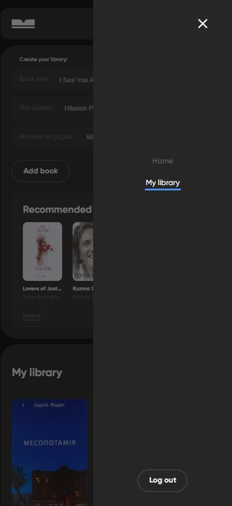
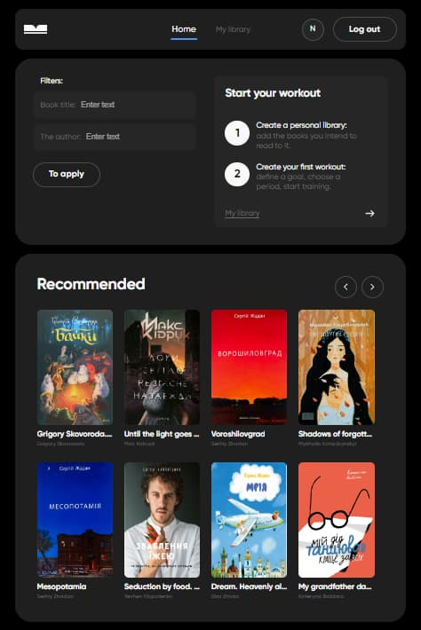
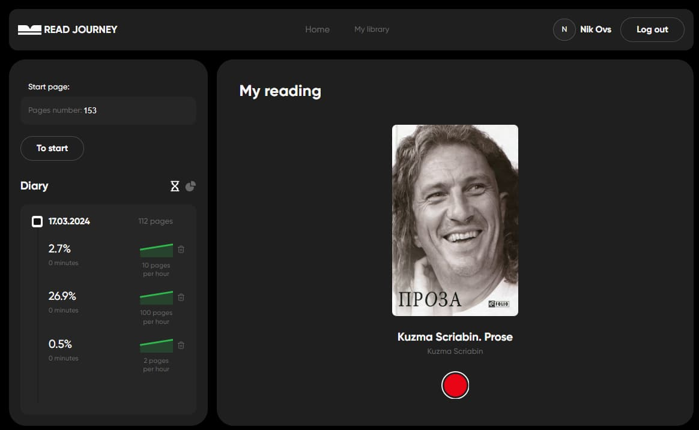

# README for Book Journey Web Application

## Introduction

aBook Journey is a web application designed to enhance the reading experience of users by allowing them to read a variety of books online. It aims to provide a seamless and interactive platform for book lovers, where they can register, track their reading statistics by days and pages read, and enjoy a personalized reading journey.

## Features
- **User Registration:** Users can sign up to access personalized features and save their reading progress.
- **Reading Statistics:** Track your reading progress with detailed statistics, including daily reading habits and the number of pages read.
- **Book Filtering:**  Easily find books by title using the search and filter functionality.
- **Custom Book Library:** Users have the ability to add books to their own library, making it easy to keep track of titles they’re interested in or currently reading.
- **Favorites:** Users can mark books as favorites, allowing for quick access to beloved titles.
- **Reading Status Filtering:**  Within the favorites section, books can be filtered based on their reading status - whether they are read, unread, or currently being read.

## Getting Started
To get started with Book Journey, users must first register for an account. Upon registration, users can immediately start exploring the vast collection of books available on the platform. Books can be added to the personal library or favorites list for easy access.

## Conclusion
Book Journey is the ideal web app for readers looking to improve their reading experience. With a user-friendly interface, comprehensive book filtering and personalized reading statistics, it provides a unique platform for book lovers to track, manage and enjoy their reading journey. Sign up today and embark on your own book journey!

For any inquiries or assistance, please contact us at [ovsyannikovnikolai1790@gmail.com](ovsyannikovnikolai1790@gmail.com).

Thank you for choosing our LearnLingo Platform!